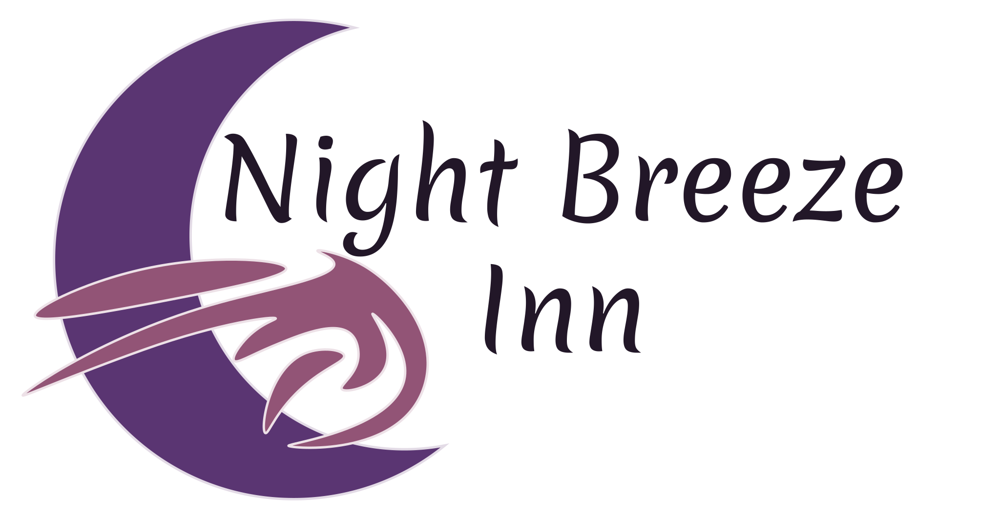

<picture>
  <source media="(prefers-color-scheme: dark)" srcset="../assets/logo-dark.svg">
  
</picture>

# Night Breeze Inn

Welcome to the **Night Breeze Inn** page. 
https://night-breeze-inn.github.io

## Who we are ?

Night Breeze Inn (or for short NBI) is a small group created by @KoRIOz675 with one objective: *Creating the best tools for TTRPG.*

### Current projects

Our main projects for now are:

* [Draconae Project](https://github.com/Night-Breeze-Inn/Draconae-Project) (A character Manager for D&D)
* [Atlas of Worlds](https://github.com/Night-Breeze-Inn/Atlas-of-Worlds) (Worldbuilding/Lore Management Tool)
* [Our website](https://night-breeze-inn.github.io) (Still in developpement)

## Contact

If you want to contact us, feel free to send an email to <a mailto="thomas@mafille.net">thomas@mafille.net</a>

## Acknowledgements

> [!NOTE]
> The logo was designed by @KoRIOz675. 
> The font used is [Merienda](https://fonts.google.com/specimen/Merienda)
